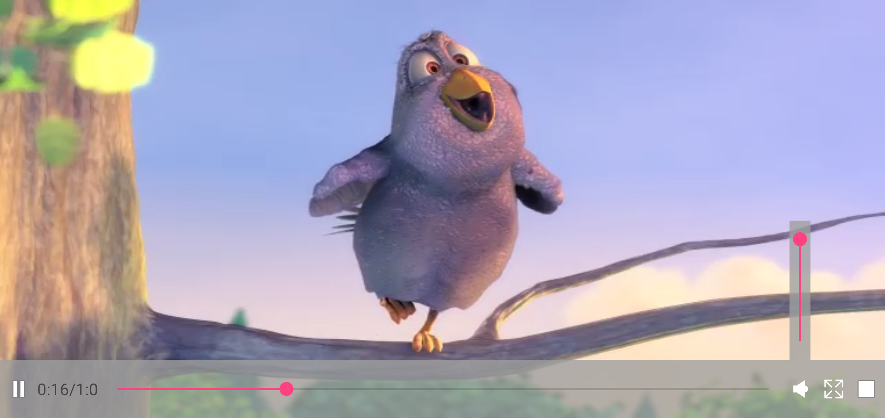

## 浙江大学安卓开发小学期 作业6

> 姓名：朱璟森
>
> 学号：3170104166
>
> 专业：计算机科学与技术

****

动图演示放置于`./gif/`目录下

### 完成内容

* 打开Image与Glide Image时会检查权限，如果无存储权限会申请，申请成功SD卡图片载入，申请失败SD卡图片不会载入，见 [image_permission.gif](./gif/image_permission.gif) 与 [glide_permission.gif](./gif/glide_permission.gif)

* IJK视频播放器中的按钮全部改为图标按钮而不是文字，使之更贴近现实中的播放器。图标全部为XML的`vector`矢量图，位于`/res/drawable/`中

* IJK视频播放器新增音量键，点击音量键会弹出竖直的音量`SeekBar`，再次点击音量键或点击屏幕其他地方音量条会随动画消失，截图：

  横屏

  

  竖屏

  

  动图演示：[video.gif](./gif/video.gif)